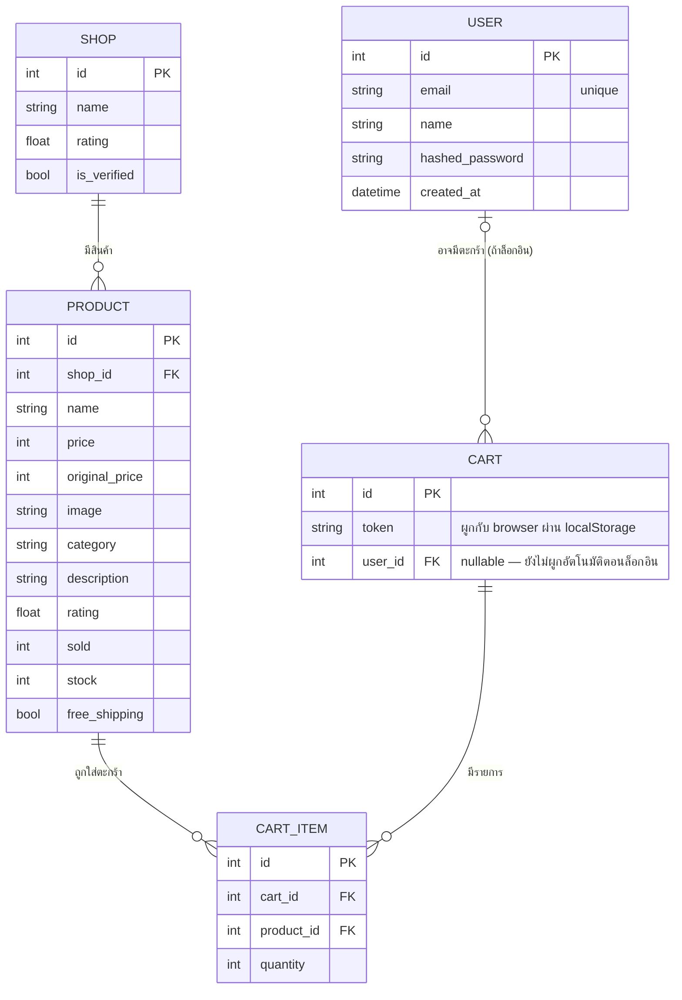

# ER Diagram

ดึง Entity หลักจากตาราง "ขั้นตอน" ใน [user-journey.md](user-journey.md): ลูกค้าเปรียบเทียบราคา/รีวิว
**หลายร้าน** ก่อนตัดสินใจซื้อ และ Pain Point ที่ว่า "ไม่รู้จะเชื่อร้านไหน" — จึงแยก **ร้านค้า (Shop)**
ออกมาเป็น entity ของตัวเอง (สัปดาห์ 2), เพิ่ม **ตะกร้าสินค้า (Cart/CartItem)** จริงในสัปดาห์ 3
แทนที่ localStorage เดิม และเพิ่ม **ผู้ใช้ (User)** ในสัปดาห์ 4 สำหรับระบบล็อกอิน

## เหตุผลการออกแบบ
- **Shop 1 — * Product** (one-to-many): ร้านค้าหนึ่งร้านขายสินค้าได้หลายชิ้น ตรงกับที่ journey แสดง
  `shop_name` กำกับทุกสินค้าในหน้ารายการ/รายละเอียด
- `Shop.rating` และ `Shop.is_verified` แยกจาก `Product.rating` เพราะคนละความหมาย: รีวิวร้านค้า
  (ความน่าเชื่อถือ) กับรีวิวสินค้าชิ้นนั้นๆ (คุณภาพสินค้า) — รองรับ Pain Point "ไม่รู้จะเชื่อร้านไหน"
- **Cart 1 — * CartItem** (one-to-many): 1 ตะกร้ามีได้หลายรายการสินค้า
- `Cart.token` แทน `user_id` ชั่วคราว เพราะยังไม่มีระบบล็อกอินตอนสัปดาห์ 3 — browser สร้าง token
  เก็บไว้ใน `localStorage` เอง แล้วส่งไปผูกกับตะกร้าใน DB ทุกครั้งที่เรียก API
- **User** (สัปดาห์ 4): เก็บ `hashed_password` เท่านั้น ไม่เก็บรหัสผ่านจริง — `Cart.user_id` เป็น
  `nullable` ไว้รองรับอนาคต แต่ยังไม่ได้ผูกอัตโนมัติตอนล็อกอิน (ตะกร้า guest ยังคง token เดิม
  จนกว่าจะทำ merge logic ในสัปดาห์ถัดไป) — ตอนนี้ User ใช้จริงกับ endpoint สร้างสินค้า/ร้านค้าเท่านั้น
- ยังไม่มีตาราง Order เพราะยังไม่เปิดขั้นตอนชำระเงินจริง (รอสัปดาห์ 5)

## Endpoint ที่ทดสอบผ่าน Swagger UI แล้ว (`/docs`)
- `GET /api/products` — คืนสินค้าทั้งหมดจาก DB จริง (join ชื่อร้านมาด้วย)
- `GET /api/products/{id}` — คืนสินค้ารายชิ้น
- `POST /api/products` — สร้างสินค้าใหม่ ผูกกับ `shop_id` ที่มีอยู่จริง
- `GET /api/shops` — คืนรายชื่อร้านค้าทั้งหมด
- `POST /api/shops` — สร้างร้านค้าใหม่
- `GET /api/cart/{token}` — คืนตะกร้าตาม token (ตะกร้าว่างถ้ายังไม่เคยเพิ่มสินค้า)
- `POST /api/cart/{token}/items` — เพิ่มสินค้าลงตะกร้า (ล็อก row สินค้ากัน race condition)
- `PATCH /api/cart/{token}/items/{product_id}` — ปรับจำนวน
- `DELETE /api/cart/{token}/items/{product_id}` — ลบออกจากตะกร้า
- `POST /api/auth/register` — สมัครสมาชิก
- `POST /api/auth/login` — ล็อกอิน คืน JWT access token
- `GET /api/auth/me` — ข้อมูลผู้ใช้ที่ล็อกอินอยู่ (ต้องแนบ Bearer token)
