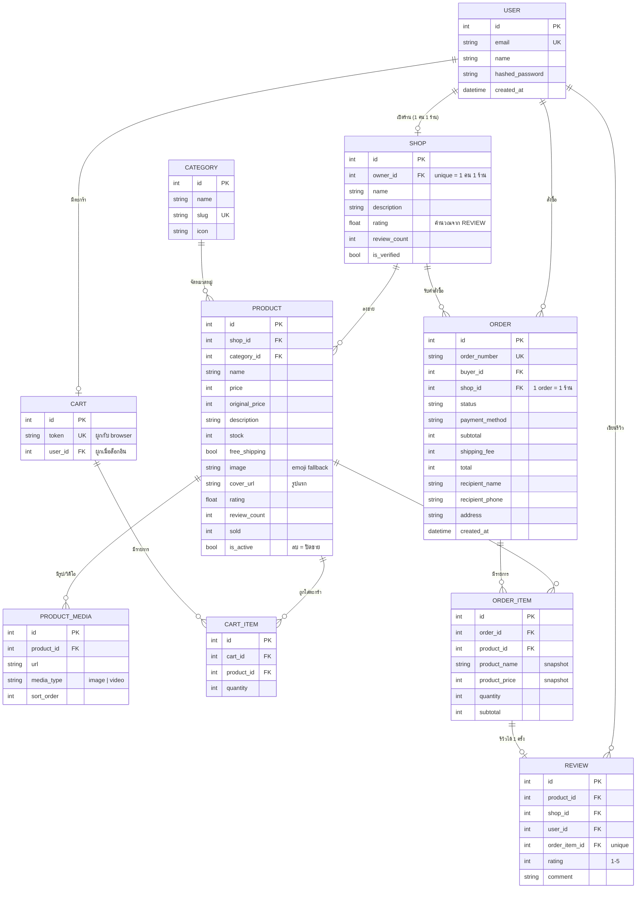

# ER Diagram

Entity ทั้งหมดดึงมาจาก [user-journey.md](user-journey.md) โดยขยายจาก marketplace ฝั่งผู้ซื้ออย่างเดียว
เป็นระบบที่ผู้ใช้คนเดียวกัน **เป็นได้ทั้งผู้ซื้อและผู้ขาย**



## เหตุผลการออกแบบ

| การตัดสินใจ | เหตุผล |
|---|---|
| **`Shop.owner_id` unique** | 1 บัญชี = 1 ร้าน ทำให้สิทธิ์ชัดเจน: ใครแก้สินค้าได้บ้างเช็คจาก `product.shop.owner_id` |
| **`Shop.rating` แยกจาก `Product.rating`** | Pain Point ในเอกสารบอกว่า "ไม่รู้จะเชื่อร้านไหน" — คะแนนร้าน (ความน่าเชื่อถือ) กับคะแนนสินค้า (คุณภาพชิ้นนั้น) คนละความหมาย ทั้งคู่คำนวณสดจาก `REVIEW` ไม่ได้กรอกเอง |
| **1 Order = 1 ร้าน** | แต่ละร้านจัดส่งแยกกัน สถานะจึงต้องแยก — ตะกร้าที่มี 3 ร้านจะถูกแยกเป็น 3 ออเดอร์ตอน checkout (พฤติกรรมเดียวกับ Shopee) |
| **`OrderItem` เก็บ snapshot ชื่อ/ราคา** | ถ้าร้านขึ้นราคาหรือเปลี่ยนชื่อสินค้าทีหลัง ใบสั่งซื้อเก่าต้องไม่เปลี่ยนตาม |
| **`Product.is_active` (soft delete)** | ลบสินค้าจริงไม่ได้เพราะ `OrderItem` อ้างอิงอยู่ — ปิดขายแทน ประวัติการซื้อยังครบ |
| **`Review.order_item_id` unique** | บังคับว่ารีวิวได้เฉพาะสินค้าที่ซื้อจริง และ 1 รายการรีวิวได้ครั้งเดียว (กันรีวิวปลอม/รีวิวซ้ำ) |
| **`Cart.token` + `user_id` (nullable)** | guest ใส่ตะกร้าได้โดยไม่ต้องล็อกอิน พอล็อกอินแล้ว `/merge` จะผูกตะกร้าเข้าบัญชีและรวมกับตะกร้าเดิม |
| **`ProductMedia` แยกตาราง** | 1 สินค้ามีรูป/วิดีโอได้หลายชิ้นและเรียงลำดับได้ (`sort_order`) ส่วน `cover_url` เป็น denormalized ไว้ให้หน้า list โหลดเร็วโดยไม่ต้อง join |

## สถานะคำสั่งซื้อ

```
PENDING_PAYMENT ──(ชำระเงิน / COD ข้ามขั้นนี้)──> PAID ──(ร้านกดจัดส่ง)──> SHIPPED
       │                    │                                                 │
       │                    │                              (ผู้ซื้อกดรับของ) ──┘
       │                    │                                                 ↓
       └──(ยกเลิก + คืน stock)──┴────> CANCELLED            DELIVERED ──(รีวิวครบ)──> COMPLETED
```

- **COD** → สร้างออเดอร์เป็น `PAID` ทันที (ถือว่ายืนยันคำสั่งซื้อ จ่ายจริงตอนรับของ)
- **โอน/บัตร** → เริ่มที่ `PENDING_PAYMENT` ผู้ซื้อต้องกด "ชำระเงิน" ก่อน
- ยกเลิกได้ทั้งผู้ซื้อและร้าน ตราบใดที่ยังไม่ `SHIPPED` — ระบบคืน stock และหักยอด `sold` ให้อัตโนมัติ
