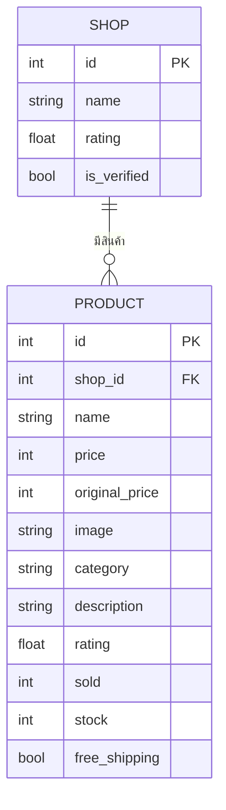

# ER Diagram (สัปดาห์ 2)

ดึง Entity หลักจากตาราง "ขั้นตอน" ใน [user-journey.md](user-journey.md): ลูกค้าเปรียบเทียบราคา/รีวิว
**หลายร้าน** ก่อนตัดสินใจซื้อ และ Pain Point ที่ว่า "ไม่รู้จะเชื่อร้านไหน" — จึงแยก **ร้านค้า (Shop)**
ออกมาเป็น entity ของตัวเอง ไม่ผูกรวมไว้ในตัวสินค้าเหมือนตอน mock data สัปดาห์ 1

## เหตุผลการออกแบบ
- **Shop 1 — * Product** (one-to-many): ร้านค้าหนึ่งร้านขายสินค้าได้หลายชิ้น ตรงกับที่ journey แสดง
  `shop_name` กำกับทุกสินค้าในหน้ารายการ/รายละเอียด
- `Shop.rating` และ `Shop.is_verified` แยกจาก `Product.rating` เพราะคนละความหมาย: รีวิวร้านค้า
  (ความน่าเชื่อถือ) กับรีวิวสินค้าชิ้นนั้นๆ (คุณภาพสินค้า) — รองรับ Pain Point "ไม่รู้จะเชื่อร้านไหน"
- ยังไม่มีตาราง Order/Cart ในสัปดาห์นี้ เพราะตะกร้ายังเก็บใน localStorage ฝั่ง frontend
  (ตามแผนจะย้ายมาเป็นตารางจริงพร้อมระบบผู้ใช้ในสัปดาห์ 3-4)

## Endpoint ที่ทดสอบผ่าน Swagger UI แล้ว (`/docs`)
- `GET /api/products` — คืนสินค้าทั้งหมดจาก DB จริง (join ชื่อร้านมาด้วย)
- `GET /api/products/{id}` — คืนสินค้ารายชิ้น
- `POST /api/products` — สร้างสินค้าใหม่ ผูกกับ `shop_id` ที่มีอยู่จริง
- `GET /api/shops` — คืนรายชื่อร้านค้าทั้งหมด
- `POST /api/shops` — สร้างร้านค้าใหม่
